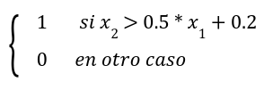
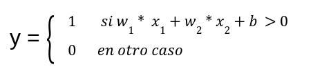
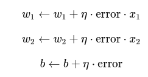
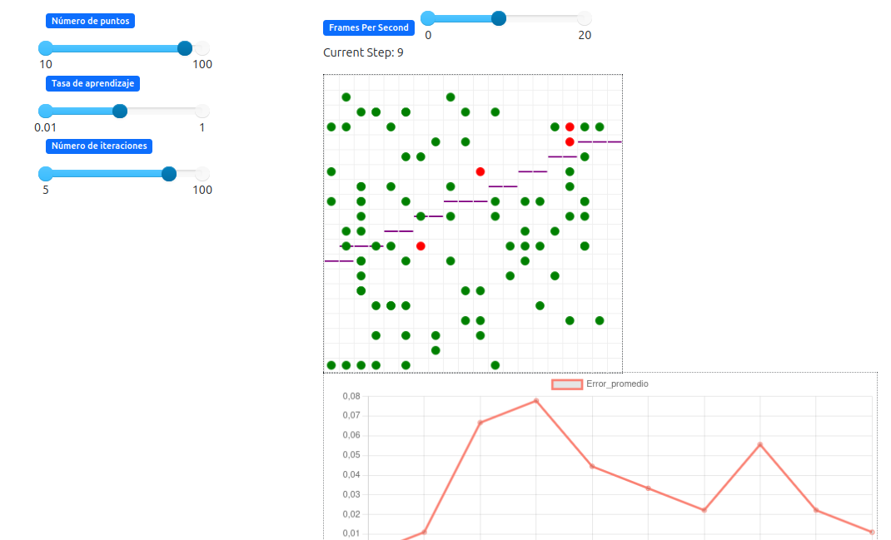
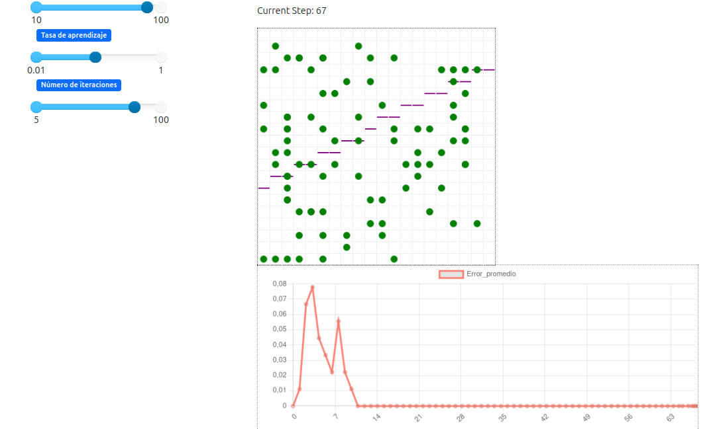

**Diseño de la solución**
 -Modelo matemático del perceptrón 

## Objetivo:  
Simular el entrenamiento de un perceptrón simple utilizando el paradigma de agentes en Python, mediante el framework MESA, para clasificar puntos 2D linealmente separables.

##  ¿Qué es un Perceptrón?

El perceptrón es un modelo matemático mas basico de un neurona artificial. Es una técnica de clasificación supervisada que determina a qué clase pertenece un punto basándose en una función lineal.

Funciona ajustando automáticamente los pesos y el sesgo de una línea de decisión en función del error cometido al clasificar los datos de entrenamiento.

## Implementación con MESA

### 🔸 Paradigma: Programación Basada en Agentes (ABM)

Este sistema se compone de agentes, cada uno de los cuales es un punto fijo en un plano 2D. El entrenamiento se centra en un modelo global, que gestiona los pesos del perceptrón y se ajusta mediante iteraciones (steps). La posición de los agentes no cambia; su única alteración de estado ocurre cuando son clasificados correcta o incorrectamente por el modelo.

### 🔸 Entradas:

- Coordenadas 2D aleatorias: x_1, x_2 
- Etiquetas asignadas según una línea real:
  

### 🔸 Entrenamiento:

- En cada step, los agentes calculan su salida con la fórmula del perceptrón y si hay error, se actualizan los pesos globales según la regla de aprendizaje.

##  Modelo Matemático

El perceptrón simple calcula la salida:

Calculo de error: 
Se calcula como la diferencia entre la etiqueta verdadera y la predicción 

 error= y_real - y_predicho

Regla de actualización: Los pesos y sesgos se actualizan usando la taza de aprendizaje de n:

## Visualización

* Puntos en pantalla:

  * Verdes: bien clasificados
  * Naranjas: mal clasificados
    
* Gráfico de error: muestra la evolución del error promedio por step
* Linea de decisión: Se dibuja de morado y se actualiza en tiempo real 
  

##  Capturas de pantalla

- Entrenamiento del Perceptrón
  

- Clasificación final

##  Resultados

* El perceptrón logró reducir el error promedio a cerca de 0 después de varias iteraciones.
* La línea de decisión aprendida logró separar correctamente los puntos, validando que los datos eran linealmente separables.
* La visualización permitió observar el proceso de aprendizaje paso a paso.

##  Conclusión

El modelo implementado demuestra cómo un perceptrón simple puede aprender a clasificar datos de forma efectiva. Además, la simulación basada en agentes permite visualizar el aprendizaje de manera dinámica e interactiva, facilitando la comprensión del funcionamiento interno del algoritmo.
