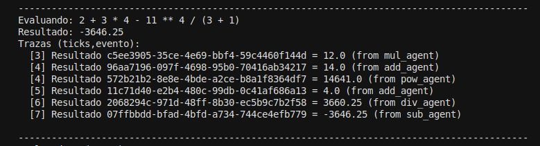

## Punto 2 - Implementación de una Calculadora Basada en el Paradigma de Agentes

**1. Objetivo**: Diseñar e implementar una calculadora distribuida basada en agentes, utilizando el framework Mesa, que sea capaz de evaluar expresiones matemáticas complejas mediante la cooperación y comunicación entre diferentes agentes especializados. Cada agente tiene una función específica (suma, resta, multiplicación, división, potencia o coordinación general), y a través de un sistema de mensajería asincrónica y sincronización por ticks, se busca simular un entorno colaborativo donde las tareas se dividen, se procesan en paralelo y se integran para producir un resultado final coherente y trazable.

### **2. Arquitectura general del sistema**

El sistema se estructura en torno a un modelo multiagente que utiliza **Mesa** como motor de simulación.
Está compuesto por los siguientes elementos principales:

1. **Agentes Operacionales (OpAgent):**
   Son los encargados de realizar operaciones matemáticas específicas (suma, resta, multiplicación, división y potencia). Cada tipo de operación tiene su propio agente independiente.
   Esto permite modularidad y paralelismo, ya que distintos agentes pueden ejecutar cálculos al mismo tiempo.

2. **Agente de Entrada/Salida (IOAgent):**
   Actúa como el coordinador central del sistema. Se encarga de:

   * Analizar la expresión matemática usando **AST (Abstract Syntax Tree)**.
   * Dividirla en subexpresiones.
   * Enviar mensajes a los agentes operacionales.
   * Recoger los resultados y combinarlos hasta obtener la respuesta final.
     También maneja errores (como divisiones por cero) y lleva un registro detallado del proceso mediante un sistema de trazas.

3. **Modelo principal (CalcModel):**
   Es el entorno que contiene a los agentes. Se encarga de:

   * Mantener las colas de mensajes (`message_queues`).
   * Controlar la ejecución de los agentes mediante un **scheduler discreto**.
   * Definir cuándo se detiene la simulación.

---

### **3. Interacción entre los agentes**

La comunicación entre agentes se realiza por medio de **mensajes asincrónicos**, donde cada agente tiene una cola de entrada independiente.
El flujo de interacción durante la evaluación de una expresión, por ejemplo:

2 + 3 \times 4 - 11⁴ / (3 + 1)

ocurre de la siguiente manera:

1. El **IOAgent** analiza la expresión con `ast` y crea un árbol que identifica las operaciones según su prioridad (por ejemplo, la potencia y la multiplicación se ejecutan antes que la suma o la resta).
2. Por cada operación detectada, el IOAgent genera un **mensaje de tipo `compute`** y lo envía al agente correspondiente.
   Ejemplo:

   ```python
   {
     'from': 'io_agent',
     'to': 'mul_agent',
     'type': 'compute',
     'request_id': 'UUID',
     'payload': {'a': 3, 'b': 4}
   }
   ```
3. El agente operacional recibe el mensaje, realiza su cálculo y responde con un mensaje `result` que contiene el valor obtenido.
4. El IOAgent recoge las respuestas, combina los resultados parciales y continúa el proceso hasta resolver completamente la expresión.
5. Si algún agente genera un error (por ejemplo, división entre cero), se envía un mensaje `error` al IOAgent, quien lo registra y detiene el cálculo.

Todo el proceso queda documentado en las **trazas del sistema**, que muestran el orden de ejecución, el agente involucrado y el resultado parcial en cada tick del modelo.

### 4. **Diseño de la Solución: Calculadora Basada en el Paradigma de Agentes**

El diseño de la calculadora se basa en el **paradigma de agentes**, donde cada operación aritmética (suma, resta, multiplicación, división y potencia) es gestionada por un **agente autónomo** e independiente. La arquitectura está compuesta por un **modelo principal (CalcModel)**, un conjunto de **agentes de operación (OpAgent)** y un **agente coordinador de entrada/salida (IOAgent)**.

1. **Modelo general (CalcModel):**
   Es el entorno donde viven y se comunican los agentes. Utiliza un **scheduler** (planificador) que ejecuta los pasos del modelo de manera ordenada, y un **sistema de colas de mensajes** para permitir la comunicación entre agentes. Cada “tick” del modelo representa un ciclo en el que todos los agentes procesan los mensajes que tienen pendientes.

2. **Agentes de operación (OpAgent):**
   Cada uno representa una operación matemática específica:

   * `add_agent` → suma
   * `sub_agent` → resta
   * `mul_agent` → multiplicación
   * `div_agent` → división
   * `pow_agent` → potencia

   Estos agentes funcionan de forma **reactiva**: cuando reciben un mensaje de tipo `"compute"`, realizan la operación con los operandos dados y envían el resultado de vuelta al agente que hizo la solicitud. Si ocurre un error (por ejemplo, división por cero), envían un mensaje de tipo `"error"`.

3. **Agente de entrada/salida (IOAgent):**
   Es el **coordinador principal**. Su tarea es recibir la expresión del usuario (por ejemplo, `2 + 3 * 4`), **analizarla sintácticamente usando el módulo `ast`**, identificar las operaciones y distribuirlas entre los agentes correspondientes.
   El IOAgent:

   * Descompone la expresión en un árbol de operaciones (AST).
   * Crea solicitudes de cálculo (`compute`) a los agentes apropiados.
   * Espera los resultados de cada suboperación.
   * Combina los resultados para obtener el valor final.

4. **Comunicación y coordinación:**
   La comunicación entre agentes se realiza mediante **mensajes almacenados en colas** (`message_queues`), donde cada agente tiene su propia bandeja de entrada. Cuando el IOAgent necesita un resultado, envía un mensaje a un agente de operación, y este le responde cuando termina el cálculo.
   Esta estrategia permite que las operaciones se realicen de forma **paralela y distribuida**, siguiendo el principio de autonomía y colaboración entre agentes.

5. **Gestión de precedencia y recursividad:**
   Gracias al uso del árbol sintáctico (`ast`), el IOAgent respeta automáticamente la **precedencia de operadores** (por ejemplo, multiplicaciones y divisiones antes de sumas y restas). Además, puede manejar expresiones complejas con paréntesis y funciones matemáticas (`sin`, `cos`, `sqrt`, etc.).

6. **Flujo general del sistema:**

   * El usuario ingresa una expresión matemática.
   * El IOAgent analiza la expresión y la descompone en suboperaciones.
   * Se envían mensajes a los agentes correspondientes.
   * Cada OpAgent procesa su operación y devuelve el resultado.
   * El IOAgent recopila los resultados parciales, los combina y devuelve el resultado final.

7. **Ventajas del diseño:**

   * Modularidad: cada agente realiza una tarea específica.
   * Escalabilidad: se pueden agregar más agentes (por ejemplo, para logaritmos o raíces).
   * Simulación realista del comportamiento distribuido y cooperativo.
   * Permite observar el flujo de mensajes y la sincronización paso a paso (ticks).

## 5. Descripción de cómo funciona la comunicación entre agentes durante el cálculo de una expresión.


 1. `[3]` : Este número entre corchetes indica el **tick**, o sea, el **instante de tiempo dentro de la simulación**.
En MESA, cada “tick” es como un turno donde los agentes actúan.

>  Tick 0 → primer paso de ejecución.
>  Tick 1 → segundo paso, y así sucesivamente.

Así sabes **en qué orden** ocurrieron las operaciones.

 2. `Resultado`: Esto significa que un agente **ha terminado una operación** y envía su resultado a otro agente (o al sistema de entrada/salida).

 3. `c5ee3905-35ce-4e69-bbf4-59c4460f144d` : Ese texto es un **identificador único (UUID)**.

Cada operación matemática que los agentes resuelven (por ejemplo, “3 * 4”) tiene su propio identificador, para que el sistema sepa a qué cálculo pertenece ese resultado.

> Es como un “número de seguimiento” del paquete (la operación).

 4. `= -3646.25 : Este es el **resultado numérico** que el agente calculó.
En este caso, fue una multiplicación (`3 * 4`) y dio `12.0`.

 5. `(from mul_agent)`: Esto indica **quién** hizo el cálculo:

* `mul_agent` → agente de multiplicación.
* `add_agent` → agente de suma.
* `sub_agent` → agente de resta.
* `div_agent` → agente de división.
* `pow_agent` → agente de potencia.

Entonces aquí se está diciendo:

>  “En el tick 3, el **agente de multiplicación** terminó una operación cuyo resultado fue **-3646.25**, y la operación estaba identificada con el código `c5ee3905-35ce-4e69-bbf4-59c4460f144d`.”


### **6. Mecanismos de comunicación y sincronización**

* **Mensajería asincrónica:**
  Los agentes se comunican intercambiando mensajes dentro de las colas gestionadas por el modelo. No hay llamadas directas ni intercambio de variables, lo que imita un entorno distribuido real.

* **Sincronización por ticks:**
  El modelo ejecuta su ciclo de simulación paso a paso. En cada tick, los agentes activos procesan un mensaje, realizan sus cálculos y envían sus respuestas.

* **Identificación de solicitudes (UUID):**
  Cada solicitud de cálculo se etiqueta con un identificador único (`request_id`) para evitar confusiones entre operaciones simultáneas y garantizar la correcta correlación de respuestas.

---

### **7. Conclusión**

El sistema multiagente diseñado logra dividir una expresión matemática compleja en operaciones más simples, distribuyéndolas entre distintos agentes que trabajan de forma coordinada.
Esta arquitectura **demuestra los principios de cooperación, autonomía y comunicación** característicos de los sistemas multiagente.
Además, la modularidad del diseño permite agregar fácilmente nuevos tipos de operaciones o agentes especializados en el futuro.

En resumen, la calculadora multiagente implementada en Mesa representa una simulación eficiente y escalable del **trabajo colaborativo entre agentes inteligentes**, capaz de procesar expresiones como:

2 + 3 \times 4 - 11⁴ / (3 + 1)

siguiendo correctamente la jerarquía de operadores, gestionando errores y registrando en detalle la comunicación interna entre los distintos agentes del sistema.


