## Punto 3 - Implementación de una Calculadora Científica usando el Paradigma de Objetos en Kotlin

## 1. Objetivos del proyecto
Diseñar e implementar una calculadora científica en Kotlin que permita realizar operaciones básicas y avanzadas, aplicando los principios de la Programación Orientada a Objetos (Encapsulamiento, herencia. polimorfismo)

## 2.  Diseño de la solución

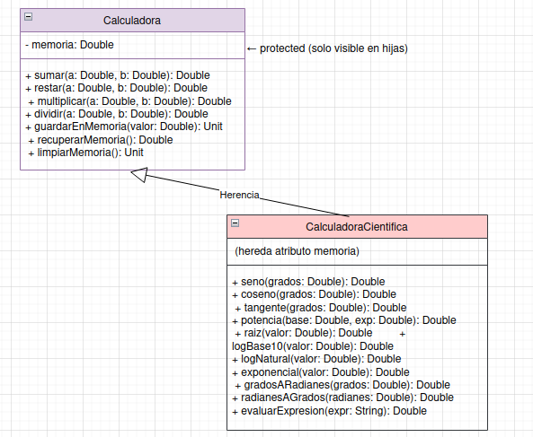

* **Clase base:** Calculadora:Encapsula la memoria y contiene métodos de operaciones básicas.
* **Clase derivada:** CalculadoraCientifica : Hereda de Calculadora y añade funciones avanzadas de trigonometría, logaritmos, exponentes y conversión de unidades.

## 3. Resultados

**Descripción de las pruebas realizadas:**

* **Operaciones básicas:**

  * Suma de dos números: ejemplo 5 + 4 = 12
    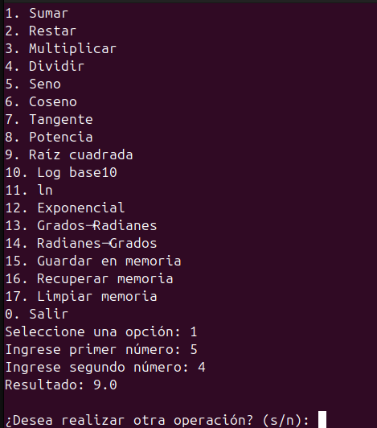

  * Resta: 10 - 4 = 6
    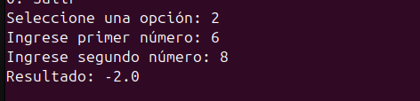

  * Multiplicación: 6 * 7 = 42
    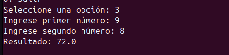

  * División: 20 / 4 = 5
 
    * División por cero: muestra el mensaje de error 
    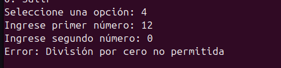

  

* **Operaciones científicas:**

  * Seno de 30° = 0.5 
  

  * Coseno de 60° = 0.5
    
    
  * Tangente de 45° = 1
    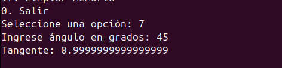
    
  * Potencia 2^3 = 8
    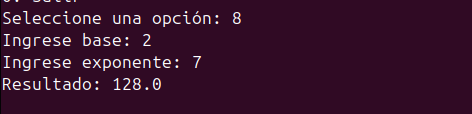
    
  * Raíz cuadrada de 16 = 4
    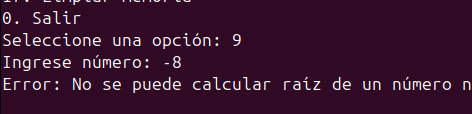
    
  * Logaritmo base 10 de 100 = 2
    
    
  * Conversión radianes→grados correcta
    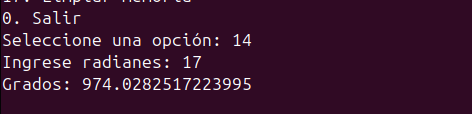

* **Funcionalidad de memoria:**

  * Guardar un valor
    
  * Recuperar valor
    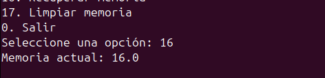
    
  * Limpiar memoria
    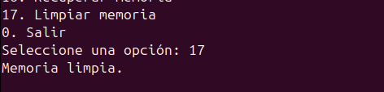

## 4️⃣ Aplicación de POO

* **Encapsulamiento:**

  * El atributo `memoria` está protegido y solo se accede mediante métodos.
* **Herencia:**

  * `CalculadoraCientifica` hereda los métodos básicos de `Calculadora` y los reutiliza.
* **Polimorfismo:**

  * Los métodos de la clase base son `open`, permitiendo redefinirlos si se requiere.

---

## 5️⃣ Conclusiones

* El proyecto demuestra cómo se puede **extender una clase base** para agregar funcionalidades avanzadas sin duplicar código.
* La **POO permite organizar mejor** el código, facilitando el mantenimiento y la ampliación de la calculadora.
* Las pruebas muestran que la calculadora funciona correctamente, cubriendo **operaciones básicas, científicas y manejo de memoria**.
* El uso de **Kotlin** hace el código **conciso y legible**, aprovechando funciones nativas de la librería `kotlin.math`.

---

✅ **Entrega lista:**

* Solo falta **insertar el diagrama UML** y las **capturas de pantalla de la calculadora en acción**.

---

Si quieres, puedo hacerte **el texto del informe en Word o PDF listo para entregar**, con los títulos, subtítulos y espacio para poner el UML y las capturas, así solo agregas las imágenes.

¿Quieres que haga eso?

## Diseño 
