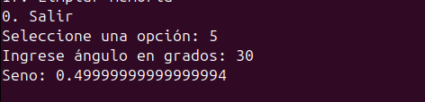
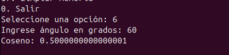

## Punto 3 - Implementación de una Calculadora Científica usando el Paradigma de Objetos en Kotlin

## 1. Objetivos del proyecto
Diseñar e implementar una calculadora científica en Kotlin que permita realizar operaciones básicas y avanzadas, aplicando los principios de la Programación Orientada a Objetos (Encapsulamiento, herencia. polimorfismo)

## 2.  Diseño de la solución

* **Clase base:** Calculadora:Encapsula la memoria y contiene métodos de operaciones básicas.
* **Clase derivada:** CalculadoraCientifica : Hereda de Calculadora y añade funciones avanzadas de trigonometría, logaritmos, exponentes y conversión de unidades.

## 3. Resultados

**Descripción de las pruebas realizadas:**

* **Operaciones básicas:**

  * Suma de dos números: ejemplo 5 + 4 = 9
    
    

  * Resta: 6 - 8 = -2
    
    

  * Multiplicación: 9 * 8 = 72
    
    

  * División: 12 / 0 = Muestra el mensaje de error
    
      
    

  

* **Operaciones científicas:**

  * Seno de 30° = 0.5
    
  

  * Coseno de 60° = 0.5
    
    
    
  * Tangente de 45° = 1
    
    
    
  * Potencia 2⁷  = 128
    
    
    
  * Raíz cuadrada de -8 = Muestra mensaje de error
    
    
    
  * Logaritmo base 10 de 100 = 2
    
   

    
  * Conversión radianes→grados correcta
    
    

* **Funcionalidad de memoria:**

  * Guardar un valor
 
     
    
  * Recuperar valor
    
    
    
  * Limpiar memoria
    
    

## 4.  Aplicación de POO

* **Encapsulamiento:** El atributo memoria está protegido y solo se accede mediante métodos.

  
* **Herencia:** CalculadoraCientifica hereda los métodos básicos de Calculadora y los reutiliza.

  
* **Polimorfismo:** Los métodos de la clase base son open, permitiendo redefinirlos si se requiere.

## 5.  Conclusión
El proyecto demuestra cómo es posible extender una clase base para agregar funcionalidades avanzadas sin duplicar código, mostrando que la Programación Orientada a Objetos permite organizar mejor el código y facilita su mantenimiento y ampliación. Las pruebas realizadas confirman que la calculadora funciona correctamente, cubriendo operaciones básicas, científicas y manejo de memoria, mientras que el uso de Kotlin hace que el código sea conciso y legible, aprovechando las funciones nativas de la librería kotlin.math.

